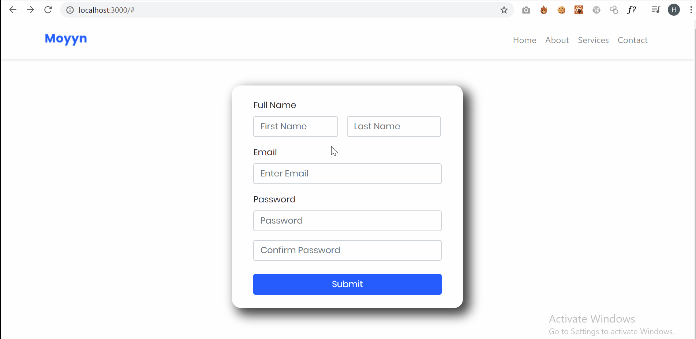

# Registration Form with dynamic validation  :
<br>

## Technologies are used :
  - Front-end : React.js ,Bootstrap
  
<br><br>

## Usage: 
<br><br>


```shell
$ git clone https://github.com/Auto-Rooter/Pilot-Task.git && cd Pilot-Task

# Install Required Packeges 
$ npm install

# Start
$ npm start

$ open http://localhost:3000


```
<br>
<br><br>


## Demo:

<br><br>




